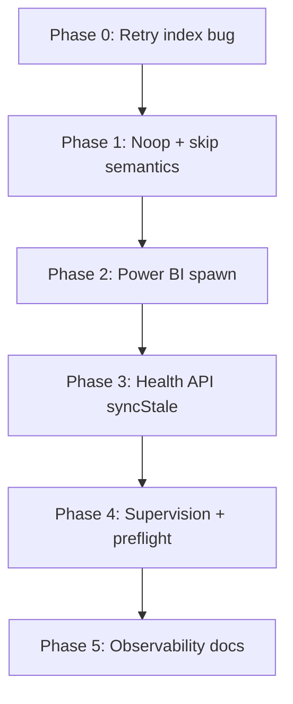

# Alberta Hospitals — Unified Health & Sync Robustness Plan

**Status:** implemented (phases 0–5)
**Date:** 2026-07-28  
**Sources synthesized:**
1. Cursor Composer 2.5 (non-fast) — `/tmp/alberta-plans/composer-2.5.md`
2. Devin GLM 5.2 — `/tmp/alberta-plans/glm-5.2.md`
3. Devin SWE 1.7 Max — `/tmp/alberta-plans/swe-1.7-max.md`
4. Antigravity Gemini 3.6 Flash (high) — `/tmp/alberta-plans/gemini-3.6-flash.md`

**Brief:** `.agent-health-issues-brief.md` (live state 2026-07-28 ~03:57Z)

---

## 0. Executive synthesis

### Consensus (all 4 agents)
| Finding | Agreement |
|---|---|
| Live `degraded` is driven by PHAC/RVD returning `partial` on **unchanged content**, not by ER/lab staleness or daily age (~15.8h < 26h soft TTL) | Unanimous |
| `syncStale = health.overall !== 'ok'` in `server.ts:140` is a **misnamed alias** — soft issues flip “stale” even when data is fresh | Unanimous |
| `powerbiScraper` fails via `execFileSync('npx', ['tsx', …], { timeout: 120000 })` — npx overhead + Puppeteer budget → `ETIMEDOUT` | Unanimous |
| openAlberta unmapped + Fraser 403 are **intentional skips**; already non-critical for domain health; pollute daily rollup to `partial_success` | Unanimous |
| Production supervisor is **launchd KeepAlive** (`com.davemini.alberta-hospital-wait-times` → `scripts/start-server.sh`), not OMP hub | 3/4 explicit; Gemini weaker but compatible |
| Surgical stays healthy via abjhi/CIHI fallbacks despite powerbi failure | Unanimous |
| Prefer boring fixes; no product features; no full-suite runs | Unanimous |

### Highest-value unique findings
| Source | Unique / strongest contribution |
|---|---|
| **Composer** | **Retry bug:** `runPipelinesWithRetry` matches `definitions.find(p => p.name === r.pipeline)` but production `SyncResult.pipeline` is camelCase module id while `Pipeline.name` is kebab-case → **retries never fire** in prod (unit stubs mask this). Index-based retry is the fix. |
| **Composer** | Prefer **reuse `success` + `note` + `recordsWritten: 0`** over a new enum member (less consumer churn). Split `syncStale` vs `healthDegraded`. |
| **GLM** | Optional `success_noop` enum + `skipReason`; failed-with-fallback domain logic; per-pipeline `withTimeout`; Chrome path via `puppeteer.executablePath()`. |
| **SWE** | Async `execFile` (not sync), 300s Power BI budget, move `syncStale` into `DataHealthSummary`, convert intentional skips to positive no-op outcomes. |
| **Gemini** | Clearest health decoupling matrix; concrete before/after snippets for PHAC/RVD and rollup; skip-neutral daily aggregation. |

### Decision calls (orchestrator)
1. **No-op status:** reuse existing **`success`** with `recordsWritten: 0` and optional **`note`** (Composer/Gemini). Do **not** add `success_noop` in v1 — every consumer already treats `success` as healthy; new enum is deferred optional polish.
2. **Intentional skips:** keep status **`skipped`**, move message to **`note`**, refine daily rollup so success+skipped ⇒ **`success`** (not `partial_success`).
3. **`syncStale`:** redefine as **daily-age / missing-timestamp / critical-down**, not soft issues. Add optional **`healthDegraded`** alias for monitors.
4. **Retry:** fix **index-based** retry (Composer) before any backoff/timeout work.
5. **Power BI:** local `node_modules/.bin/tsx` (or bundled `dist/powerbiScraper.cjs`), timeout **180–210s** (300s acceptable), optional one retry after index fix; keep `failed` visible if still broken (don’t hide behind skip until spawn is fixed).
6. **Supervision:** launchd is canonical; hub is dev-only; preflight warns on orphan `:3004` listeners.

---

## 1. Diagnosis (unified root causes)

### Live failure chain (reproduced)
```
phacFetcher + albertaRespiratoryVirusScraper
  → status: 'partial' (content unchanged)
  → assessDomain('public-health') → state: 'partial'
  → softIssues[] non-empty
  → assessDataHealth overall: 'degraded'
  → server.ts syncStale = (overall !== 'ok') → true
```
ER/lab were fresh (~7 min). Daily age ~15.8h was **inside** 26h soft TTL. Surgical healthy via fallbacks. Edge push OK. **No criticalIssues.**

### Per-issue root causes

| # | Issue | Root cause | Primary files |
|---|---|---|---|
| 1 | Health degraded / syncStale | Soft `partial` → overall degraded; `syncStale` aliased to overall | `server.ts:140`, `src/lib/dataHealth.ts` (`assessDomain`, `assessDataHealth`), `cloudflare/worker.ts` |
| 2 | powerbi ETIMEDOUT | `npx tsx` spawn + 120s hard kill; child navigation alone ~90s+ | `orchestrator.ts` `runPowerBIScraper`, `powerbiScraper.ts` |
| 3 | PHAC/RVD partial | Designed: `status: contentChanged ? 'success' : 'partial'` | `phacFetcher.ts` ~L351, `albertaRespiratoryVirusScraper.ts` ~L906 |
| 4 | openAlberta skip | Catalog-only when 0 domain maps; correct skip, noisy rollup | `openAlbertaFetcher.ts` ~L380–398 |
| 5 | Fraser 403 | Intentional skip on block; already non-soft-issue | `fraserDownloader.ts` ~L268–279 |
| 6 | Supervision gap | Live process is direct `node dist/server.cjs`; hub entries stale; launchd may not own port | `launchd/*.plist`, `scripts/start-server.sh`, ops host-hardening runbook |
| 7 | Retry/aggregation | **Name mismatch kills retries**; rollup treats skip as partial_success; no per-pipeline timeout on in-process runs | `orchestrator.ts` `runPipelinesWithRetry` ~L189–195, `syncStatus.ts` `applyDailySyncResults` |

---

## 2. Goals / non-goals

### Goals
1. `/api/health` → `status: "ok"`, `syncStale: false`, empty `softIssues` when domains are within TTL and only intentional no-ops/skips occurred.
2. Unchanged upstream content reports as **success** (noop), not partial.
3. Power BI spawn no longer dies on `npx ETIMEDOUT` under normal load; failures still visible if Chrome/report truly broken.
4. Production retries actually execute for real transient `failed` results.
5. Daily rollup: intentional skips do not demote a clean run to `partial_success`.
6. Launchd owns `:3004` with `.env` loaded; orphan/hub processes detected.
7. Worker + server health field semantics stay aligned.

### Non-goals
- Mapping all 38 Open Alberta CKAN resources
- Replacing launchd with hub/pm2
- New product domains / UI features
- Full test suite as part of this change order
- Cloudflare KV schema redesign
- Parallelizing the daily orchestrator

---

## 3. Design decisions — status & health matrix

### Pipeline outcome vocabulary (v1)

| Outcome | `status` | `recordsWritten` | `error` | `note` | Domain health | Daily rollup | Retry? |
|---|---|---|---|---|---|---|---|
| Updated data | `success` | > 0 | — | optional | healthy (TTL) | success | no |
| Verified unchanged / noop | `success` | 0 | — | yes | healthy (run timestamp anchors freshness) | success | no |
| True incomplete fetch | `partial` | some | yes | optional | partial → **soft issue** | partial_success | no |
| Intentional skip (403, unmapped, optional) | `skipped` | 0 | — | yes | skipped / masked by sibling success | **neutral** (does not demote) | no |
| Hard failure | `failed` | 0 | yes | optional | failed or partial if newer than success* | partial_success / failed | **yes, once** (index-based) |
| Manual baseline | `manual` | — | — | — | soft | warning | no |

\*Multi-pipeline domains (surgical, spending): if a **newer non-failed** sibling exists within TTL, domain stays healthy (already mostly true via `latestNonFailedResultForDomain`).

### Daily rollup (`applyDailySyncResults`)
- All `success` (incl. noop) → `success`
- `success` + `skipped` only → **`success`** (change)
- Any true `partial` mixed → `partial_success`
- Any `failed` + any `success` → `partial_success`
- All `failed` → `failed`

### `/api/health` fields
| Field | Meaning after fix |
|---|---|
| `status` / overall | Domain-aware health (`ok` / `degraded` / `down`) from `assessDataHealth` |
| `syncStale` | **Daily sync missing OR age > 26h soft TTL OR overall `down`** — NOT soft issues alone |
| `healthDegraded` (new, optional) | `status !== 'ok'` for monitors that want the old alias behavior |
| `softIssues` | Real soft problems only (`partial` true incompleteness, soft_stale TTLs) — not noop/skip |

### Deferred (optional polish, not v1)
- New `success_noop` enum member (GLM/SWE) — only if product wants explicit telemetry distinction after v1 ships
- `skipReason` enum (`unmapped` | `blocked_403` | `no_data`) — nice-to-have on `note` structured field later
- Demoting optional failed sources (powerbi) to skip when fallbacks fresh — only if spawn fix insufficient

---

## 4. Phased work plan



### Phase 0 — Orchestrator retry correctness (unblocks everything)
**Files:** `src/pipelines/orchestrator.ts`, `tests/unit/dailySyncC4.test.ts`  
**Work:**
1. In retry loop, use `definitions[index]` / `failedDefinitions` entry — **never** `definitions.find(p => p.name === r.pipeline)`.
2. Standardize thrown-path `pipeline` id to **module id** (camelCase), matching successful `run()` results.
3. Add unit test with production-like kebab `name` + camelCase result `pipeline` proving retry invokes the pipeline.

### Phase 1 — Pipeline outcome semantics
**Files:**
- `src/pipelines/types.ts` — optional `note?: string`
- `src/pipelines/phacFetcher.ts`
- `src/pipelines/albertaRespiratoryVirusScraper.ts`
- `src/pipelines/openAlbertaFetcher.ts`
- `src/pipelines/fraserDownloader.ts`
- `src/pipelines/syncStatus.ts` — rollup rules + history nonSuccess filtering
- `tests/unit/dataHealth.test.ts`, `tests/unit/syncStatusC1C2.test.ts`

**Work:**
1. PHAC/RVD unchanged → `status: 'success'`, `recordsWritten: 0`, `note: '…unchanged…'`, clear `error`.
2. openAlberta catalog-only / Fraser 403 → keep `skipped`, message in `note` not `error`.
3. Rollup: success+skipped ⇒ `success`.
4. History: intentional skips out of `failures[]` (or rename to `nonSuccess` and filter).

### Phase 2 — Power BI spawn hardening
**Files:** `src/pipelines/orchestrator.ts`, `src/pipelines/powerbiScraper.ts`, optionally `package.json` / build script  
**Work:**
1. Resolve runner: `node_modules/.bin/tsx` if present; else `node --import tsx`; **avoid `npx`** on the happy path.
2. Preferred durable option: esbuild/bundle to `dist/powerbiScraper.cjs` and `execFile(process.execPath, [bundle], …)`.
3. Timeout **180_000–210_000** ms (env `POWERBI_SCRAPER_TIMEOUT_MS`); SWE’s 300s OK if measured need.
4. Prefer async `execFile` + kill on timeout over `execFileSync` (SWE) if easy; sync OK if timeout correct.
5. Chrome: `process.env.CHROME_PATH` → existing macOS path → `puppeteer.executablePath()` if exists.
6. One retry only after Phase 0 fix; optional 5s backoff.
7. Do **not** convert powerbi failure to skip until spawn proven.

### Phase 3 — Health API alignment
**Files:** `src/lib/dataHealth.ts`, `server.ts`, `cloudflare/worker.ts`, `src/hooks/useDataHealth.ts` (if needed), `scripts/check-data-health.mjs`, tests  
**Work:**
1. `syncStale` = missing daily timestamp OR age > 26h OR overall `down` (implement in `assessDataHealth` or server using checks).
2. Optional `healthDegraded: overall !== 'ok'`.
3. Confirm noop `success` never enters `softIssues`.
4. Tests: fixture matching brief → after fix, overall `ok`, `syncStale: false`.
5. Worker parity for same fields.

### Phase 4 — Supervision
**Files:** `scripts/preflight.sh`, `scripts/start-server.sh`, `ops/runbooks/host-hardening.md`, `AGENTS.md`  
**Operator actions (not code):**
1. Kill orphan `:3004` if not launchd-owned.
2. `launchctl kickstart -k gui/$(id -u)/com.davemini.alberta-hospital-wait-times` (or `scripts/install-launchd.sh`).
3. Confirm `lsof` shows `node dist/server.cjs`, LAN `0.0.0.0:3004`, `.env` loaded (push secrets present).
4. Clear stale hub names `ab-hospitals` / `dev` so monitoring isn’t confused.

**Code/docs:**
1. Preflight WARN if listener cmdline is tsx/hub/orphan.
2. Document: hub = dev only; prod = launchd + start-server.sh.
3. Note stale-build guard in start-server.sh (warns, still starts, when dist predates source).

### Phase 5 — Observability polish
**Files:** runbooks, optional `skipReason` later  
**Work:** Document expected skips (Fraser 403, openAlberta catalog). Clarify sync history labels. Optional per-pipeline default timeout wrapper for in-process pipelines (GLM) — only if hung scrapers observed.

---

## 5. Per-issue fix steps (implementation checklist)

### 5.1 Public-health noop
- [ ] `phacFetcher`: unchanged → `success` + note, no error
- [ ] `albertaRespiratoryVirusScraper`: same
- [ ] Keep no-rewrite file behavior / metadata ownership
- [ ] Unit: public-health noop + fresh ER → overall `ok`

### 5.2 powerbiScraper
- [ ] Local binary / bundled cjs spawn
- [ ] Timeout ≥ 180s + env override
- [ ] Chrome path resolution
- [ ] Phase 0 retry actually reaches powerbi on failure
- [ ] Smoke: no `spawnSync npx ETIMEDOUT` on normal host

### 5.3 openAlberta
- [ ] Keep skipped; `note` for catalog message
- [ ] No mapping sprint
- [ ] Rollup success+skip = success

### 5.4 fraser
- [ ] Keep skipped on 403; `note` not error
- [ ] Confirm spending healthy via CIHI/billing

### 5.5 Health / syncStale
- [ ] Decouple `syncStale` from soft issues
- [ ] Optional `healthDegraded`
- [ ] Server + worker + tests

### 5.6 Supervision
- [ ] launchd owns port; preflight detects orphans
- [ ] Docs in AGENTS.md / host-hardening
- [ ] Kill-9 recovery within ~60s via KeepAlive

### 5.7 Retry / aggregation
- [ ] Index-based retry + stable pipeline ids
- [ ] Rollup rules as matrix
- [ ] Optional: no retry on deterministic 403; single retry max

---

## 6. Risks & edge cases

| Risk | Mitigation |
|---|---|
| Noop-as-success hides true upstream death | Fetch/parse errors still `failed`; empty parse should `failed`/`skipped` with note, not silent success |
| `syncStale` meaning change breaks external monitors | Add `healthDegraded`; grep consumers (`useDataHealth`, uptime scripts); document |
| Longer Power BI timeout slows daily job | Once daily; acceptable; don’t parallelize yet |
| start-server port reclaim kills dev | Dev uses different PORT or stop launchd first |
| Double supervisors (hub + launchd) | Hub stop before kickstart; preflight WARN |
| Stale on-disk partials after deploy | One `npm run daily-sync` after ship |
| Failed-with-fallback timestamp races | Prefer latest non-failed ≥ failure → healthy; test both orderings |
| Bundled Chromium missing | Fall back Chrome path; clear skip/fail message if none |

---

## 7. Verification plan (targeted)

```bash
# Unit (affected only — not full suite)
npx tsx --test tests/unit/dataHealth.test.ts \
  tests/unit/dailySyncC4.test.ts \
  tests/unit/syncStatusC1C2.test.ts
npx tsc --noEmit
npm run build
```

**Smoke**
1. Restart via launchd / start-server; `curl -sS http://127.0.0.1:3004/api/health | jq '{status,syncStale,softIssues,criticalIssues,checks}'`
2. `npm run daily-sync` (or POST trigger if present) → inspect pipeline statuses
3. Expect PHAC/RVD ∈ `{success}` with note when unchanged; powerbi ≠ npx ETIMEDOUT; fraser/openAlberta `skipped` with note
4. Expect health `ok` + `syncStale: false` when daily < 26h and ER fresh
5. LAN: `curl -sS http://<lan-ip>:3004/api/health`
6. Supervision: `kill -9` listener → relaunch ≤ 60s; `launchctl list | grep alberta-hospital`
7. Preflight: `scripts/preflight.sh`

---

## 8. Acceptance criteria

| ID | Criterion | Observable |
|---|---|---|
| A1 | Noop public-health no longer degrades | `/api/health` `status: ok`, `softIssues: []`, public-health `healthy` after unchanged PHAC/RVD |
| A2 | `syncStale` is age/critical based | Fresh daily (<26h) → `syncStale: false` even if optional skip present |
| A3 | Power BI spawn reliable | No `npx ETIMEDOUT` on normal run; or single successful retry; no “Cannot retry unknown pipeline” |
| A4 | Intentional skips non-degrading | Fraser 403 + openAlberta unmapped → `skipped`; spending `healthy`; daily rollup `success` if no real fails |
| A5 | Surgical with powerbi fail + abjhi success | Domain `healthy` |
| A6 | Retries work in production ids | dailySyncC4 test with mismatched name/id; live retry log proves re-entry |
| A7 | Supervision | launchd owns `:3004`; preflight clean; LAN bind `0.0.0.0`; `.env` loaded |
| A8 | Worker parity | Cloudflare health uses same `syncStale` semantics |
| A9 | Targeted tests + typecheck green | dataHealth / dailySyncC4 / syncStatusC1C2 + `tsc --noEmit` |

**Definition of done:** The live brief failure mode (degraded solely from PHAC/RVD noop partials + misleading syncStale) is eliminated; orchestrator retries work; powerbi spawn is materially more reliable; intentional skips don’t poison rollup; launchd supervision is documented and verifiable.

---

## 9. Suggested implementation order for agents

1. **Phase 0 + 1** together (semantics + retry) — unblocks false degraded immediately after next sync or fixture rewrite.
2. **Phase 3** right after (syncStale) — makes `/api/health` honest even before next full daily.
3. **Phase 2** Power BI — reliability.
4. **Phase 4–5** ops polish.

Commit to `main` after each verified phase per repo `AGENTS.md`. Push only on explicit user approval.

---

## 10. Source plan index

| Agent | Model | Artifact |
|---|---|---|
| Cursor Composer 2.5 non-fast | `cursor/composer-2.5` (plan mode, fast off) | `~/.cursor/plans/Health Robustness Plan-714483d3.plan.md` |
| Devin GLM 5.2 | `omp/devin/glm-5-2` | `/tmp/alberta-plans/glm-5.2.md` |
| Devin SWE 1.7 Max | `omp/devin/swe-1-7` (xhigh) | `/tmp/alberta-plans/swe-1.7-max.md` |
| Antigravity Gemini 3.6 Flash high | `omp/google-antigravity/gemini-3.6-flash` | `/tmp/alberta-plans/gemini-3.6-flash.md` |
